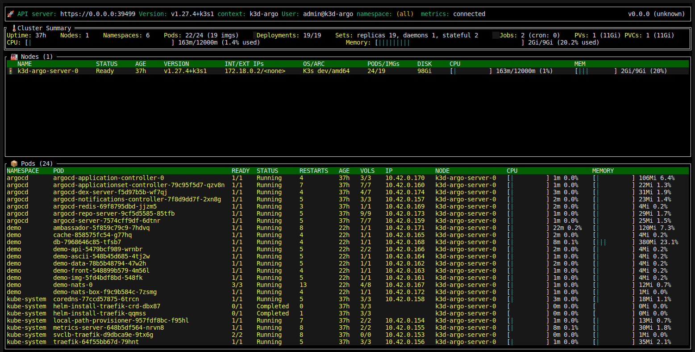

# Kubectl extension

1. First of all we need to install a working plugin [example](https://github.com/vladimirvivien/ktop) mentioned in the task and check it out:
```bash
$ go install github.com/vladimirvivien/ktop@latest
$ export PATH=$PATH:~/go/bin
$ ktop
Connected to: https://0.0.0.0:39499
 _    _ 
| | _| |_ ___  _ __
| |/ / __/ _ \| '_ \
|   <| || (_) | |_) |
|_|\_\\__\___/| .__/
              |_|
```
       

2. Now we need to deal with [kubectl plugins installation flow](https://krew.sigs.k8s.io/plugins/):
```bash
(
  set -x; cd "$(mktemp -d)" &&
  OS="$(uname | tr '[:upper:]' '[:lower:]')" &&
  ARCH="$(uname -m | sed -e 's/x86_64/amd64/' -e 's/\(arm\)\(64\)\?.*/\1\2/' -e 's/aarch64$/arm64/')" &&
  KREW="krew-${OS}_${ARCH}" &&
  curl -fsSLO "https://github.com/kubernetes-sigs/krew/releases/latest/download/${KREW}.tar.gz" &&
  tar zxvf "${KREW}.tar.gz" &&
  ./"${KREW}" install krew
)       

$ nano ~/.bashrc

# Add this row: export PATH="${KREW_ROOT:-$HOME/.krew}/bin:$PATH"

$ source ~/.bashrc

$ k krew
krew is the kubectl plugin manager.
You can invoke krew through kubectl: "kubectl krew [command]..."

Usage:
  kubectl krew [command]

Available Commands:
  help        Help about any command
  index       Manage custom plugin indexes
  info        Show information about an available plugin
  install     Install kubectl plugins
  list        List installed kubectl plugins
  search      Discover kubectl plugins
  uninstall   Uninstall plugins
  update      Update the local copy of the plugin index
  upgrade     Upgrade installed plugins to newer versions
  version     Show krew version and diagnostics

Flags:
  -h, --help      help for krew
  -v, --v Level   number for the log level verbosity

Use "kubectl krew [command] --help" for more information about a command.

# Let's try and install `ns` plugin to switch between namespaces
$ k krew install ns
Updated the local copy of plugin index.
Installing plugin: ns
Installed plugin: ns
\
 | Use this plugin:
 |      kubectl ns
 | Documentation:
 |      https://github.com/ahmetb/kubectx
 | Caveats:
 | \
 |  | If fzf is installed on your machine, you can interactively choose
 |  | between the entries using the arrow keys, or by fuzzy searching
 |  | as you type.
 | /
/
WARNING: You installed plugin "ns" from the krew-index plugin repository.
   These plugins are not audited for security by the Krew maintainers.
   Run them at your own risk.   

$ k ns
default
kube-system
kube-public
kube-node-lease
argocd
demo    

$ k ns argocd
Context "k3d-argo" modified.
Active namespace is "argocd".   

# Let's list the plugins installed:
$ k plugin list
The following compatible plugins are available:

/home/nickpimankov/.krew/bin/kubectl-krew
/home/nickpimankov/.krew/bin/kubectl-ns   
```   

3. Plugin development starts here:  
- creating initial script file with the code provided in the task and making it executable:  
```bash
#!/bin/bash

# Define command-line arguments

RESOURCE_TYPE=$0

# Retrieve resource usage statistics from Kubernetes
kubectl $2 $RESOURCE_TYPE -n $1 | tail -n +2 | while read line
do
  # Extract CPU and memory usage from the output
  NAME=$(echo $line | awk '{print $1}')
  CPU=$(echo $line | awk '{print $2}')
  MEMORY=$(echo $line | awk '{print $3}')

  # Output the statistics to the console
  # "Resource, Namespace, Name, CPU, Memory"
done
``` 
```bash   
$ touch kubeplugin
$ chmod +x kubeplugin
$ ls -al kubeplugin
-rwxrwxr-x 1 nickpimankov nickpimankov 0 кві 24 13:05 kubeplugin
```
- copy the plugin to `PATH` according to [instruction](https://kubernetes.io/docs/tasks/extend-kubectl/kubectl-plugins/):
```bash
$ sudo cp ./kubeplugin /usr/local/bin/kubectl-kubeplugin    

$ k plugin list
The following compatible plugins are available:

/home/nickpimankov/.krew/bin/kubectl-krew
/home/nickpimankov/.krew/bin/kubectl-ns
/usr/local/bin/kubectl-kubeplugin   
```   

4. Refactor the code:
- add script usage parameters:
```bash
if [ "$#" -ne 2 ]; then
    echo "Usage: $0 <node or pod> <namespace>"
    exit 1
fi
```   
- define the resource to get the data from:
```bash
$ k top pod -n argocd
NAME                                               CPU(cores)   MEMORY(bytes)   
argocd-application-controller-0                    6m           82Mi            
argocd-applicationset-controller-79c95f5d7-qzv8n   1m           20Mi            
argocd-dex-server-f5d97b5b-wf7qj                   1m           21Mi            
argocd-notifications-controller-7f8d9dd7f-2xn8g    1m           20Mi            
argocd-redis-69f8795dbd-jjzm5                      2m           3Mi             
argocd-repo-server-9cf5d5585-85tfb                 1m           24Mi            
argocd-server-7574cff9df-6dtnr                     2m           23Mi
```   
- add the desired variables output with coma:
```bash
echo "$RESOURCE_TYPE, $NAMESPACE, $NAME, $CPU, $MEMORY"
```   

5. Examples in use:   
```bash
$ k kubeplugin pod argocd
pod, argocd, argocd-application-controller-0, 6m, 107Mi
pod, argocd, argocd-applicationset-controller-79c95f5d7-qzv8n, 1m, 20Mi
pod, argocd, argocd-dex-server-f5d97b5b-wf7qj, 2m, 24Mi
pod, argocd, argocd-notifications-controller-7f8d9dd7f-2xn8g, 1m, 20Mi
pod, argocd, argocd-redis-69f8795dbd-jjzm5, 2m, 3Mi
pod, argocd, argocd-repo-server-9cf5d5585-85tfb, 1m, 31Mi
pod, argocd, argocd-server-7574cff9df-6dtnr, 1m, 24Mi   

$ k kubeplugin node argocd
node, argocd, k3d-argo-server-0, 155m, 1%
```